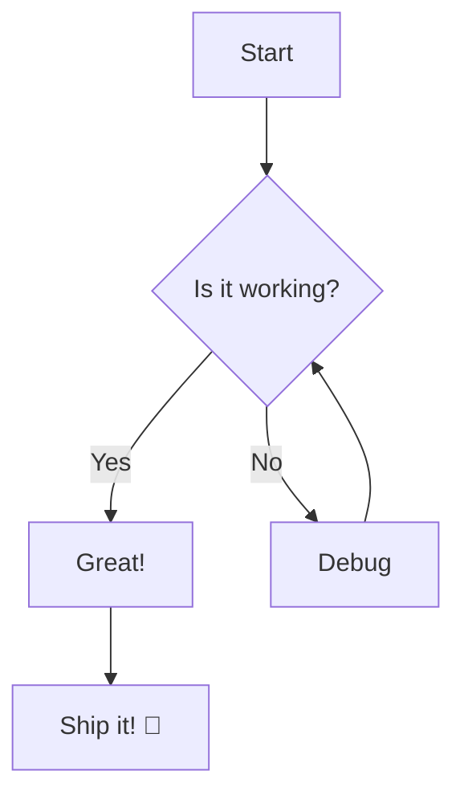
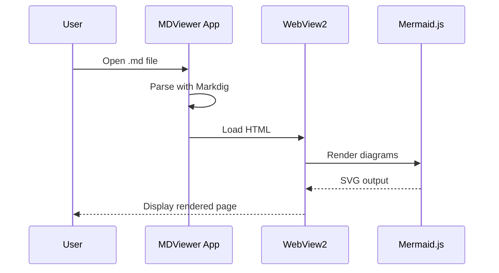
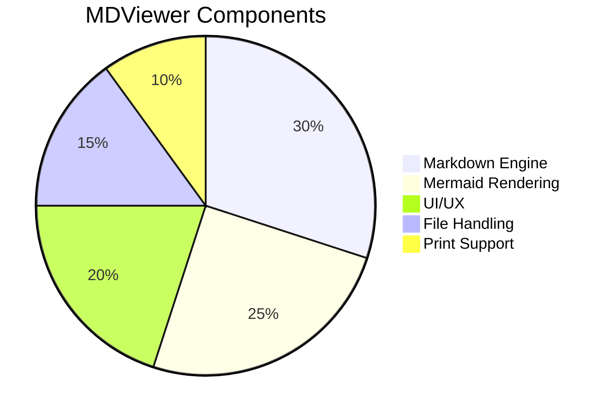

# MDViewer Test Document

This is a test document for the **MDViewer** application. It tests various Markdown features and Mermaid diagram rendering.

## Table of Contents

- [Text Formatting](#text-formatting)
- [Code Blocks](#code-blocks)
- [Tables](#tables)
- [Mermaid Diagrams](#mermaid-diagrams)

## Text Formatting

This is a paragraph with **bold**, *italic*, and `inline code`. Here's a [link](https://example.com).

> This is a blockquote. It can contain **formatted text** and other elements.

### Lists

- Item one
- Item two
  - Nested item
  - Another nested item
- Item three

1. First
2. Second
3. Third

### Task List

- [x] Completed task
- [ ] Incomplete task
- [x] Another completed task

---

## Code Blocks

```csharp
public class HelloWorld
{
    public static void Main(string[] args)
    {
        Console.WriteLine("Hello, MDViewer!");
    }
}
```

```json
{
    "name": "MDViewer",
    "version": "1.0.0",
    "features": ["markdown", "mermaid", "print"]
}
```

## Tables

| Feature | Status | Notes |
|---------|--------|-------|
| Markdown Rendering | ✅ Done | Using Markdig |
| Mermaid Diagrams | ✅ Done | Using Mermaid.js |
| Zoom Controls | ✅ Done | 25% - 500% |
| Print Support | ✅ Done | Via WebView2 |
| Dark Theme | ✅ Done | System theme |

## Mermaid Diagrams

### Flowchart



### Sequence Diagram



### Pie Chart



## Images

Markdown supports images, though none are included in this test.

## Horizontal Rule

---

*End of test document.* Built with ❤️ using .NET 10 and WPF.
