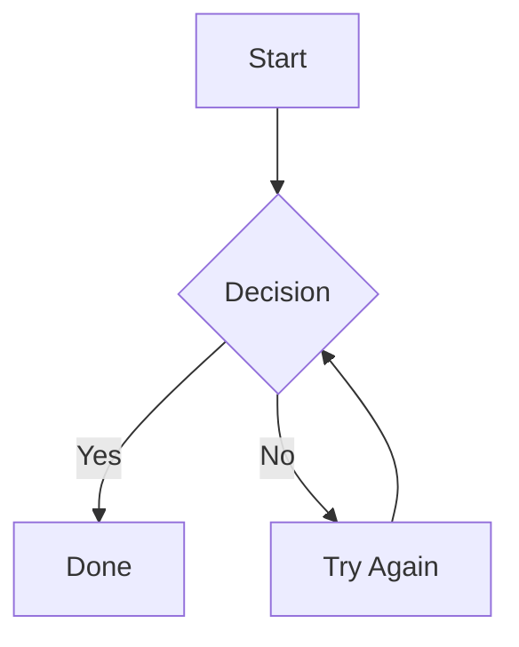

# MDViewer

A lightweight desktop application for viewing Markdown files with full **Mermaid diagram** support. Built with WPF and .NET 10.


## Features

- **Markdown Rendering** — Full CommonMark support plus tables, task lists, emoji, auto-links, and more via [Markdig](https://github.com/xoofx/markdig)
- **Mermaid Diagrams** — Flowcharts, sequence diagrams, pie charts, Gantt charts, and all Mermaid diagram types rendered inline
- **8.5 × 11 Page Layout** — Document displayed in a print-ready page format with white page on a neutral background
- **Zoom Controls** — Zoom in/out from 25% to 500% with keyboard shortcuts
- **Print Support** — Print rendered documents directly via the system print dialog
- **System Theme** — Automatically follows Windows light/dark theme setting
- **File Association** — Register as the default `.md` file handler to open files with a double-click
- **Auto-Reload** — Automatically re-renders when the open file changes on disk
- **Single-File Deployment** — Publish as a single self-contained EXE

## Screenshots

*Open a Markdown file with Mermaid diagrams rendered inline on an 8.5×11 page.*

## Getting Started

### Prerequisites

- [.NET 10 SDK](https://dotnet.microsoft.com/download/dotnet/10.0) or later
- [WebView2 Runtime](https://developer.microsoft.com/en-us/microsoft-edge/webview2/) (included with Windows 11; install separately on Windows 10)

### Build & Run

```bash
cd MDViewer
dotnet run
```

To open a specific file:

```bash
dotnet run -- "path\to\your\file.md"
```

### Publish as Single-File EXE

```bash
cd MDViewer
dotnet publish -p:PublishProfile=SingleFile
```

The output will be in `bin\publish\`. The resulting `MDViewer.exe` is a fully self-contained executable — no .NET runtime installation needed on the target machine.

## Usage

| Action | Shortcut |
|--------|----------|
| Open file | `Ctrl+O` |
| Print | `Ctrl+P` |
| Zoom in | `Ctrl+Plus` |
| Zoom out | `Ctrl+Minus` |
| Reset zoom | `Ctrl+0` |

### Opening Files

- **Double-click** a `.md` file (after registering the file association on first launch)
- **Drag and drop** a file path as a command-line argument
- **File picker** opens automatically if no file is provided

### Mermaid Diagrams

Standard Mermaid fenced code blocks are rendered automatically:

````markdown

````

All [Mermaid diagram types](https://mermaid.js.org/intro/) are supported: flowcharts, sequence diagrams, class diagrams, state diagrams, Gantt charts, pie charts, and more.

## Project Structure

```
MDViewer/
├── MDViewer.csproj                    — Project file (.NET 10, WPF)
├── App.xaml / App.xaml.cs             — Application entry point
├── MainWindow.xaml / .cs              — Main UI with WebView2 and toolbar
├── Services/
│   ├── MarkdownRenderService.cs       — Markdig Markdown → HTML pipeline
│   ├── ThemeService.cs                — Windows light/dark theme detection
│   └── FileAssociationService.cs      — .md file type registry association
├── Assets/
│   ├── template.html                  — HTML page template (8.5×11 CSS layout)
│   ├── mermaid.min.js                 — Bundled Mermaid.js library
│   └── app.ico                        — Application icon
└── Properties/PublishProfiles/
    └── SingleFile.pubxml              — Single-file publish configuration
```

## Technology

| Component | Technology |
|-----------|-----------|
| UI Framework | WPF (.NET 10) |
| Markdown Parser | [Markdig](https://github.com/xoofx/markdig) |
| Diagram Renderer | [Mermaid.js](https://mermaid.js.org/) |
| Browser Control | [WebView2](https://developer.microsoft.com/en-us/microsoft-edge/webview2/) |

## License

This project is licensed under the MIT License.
